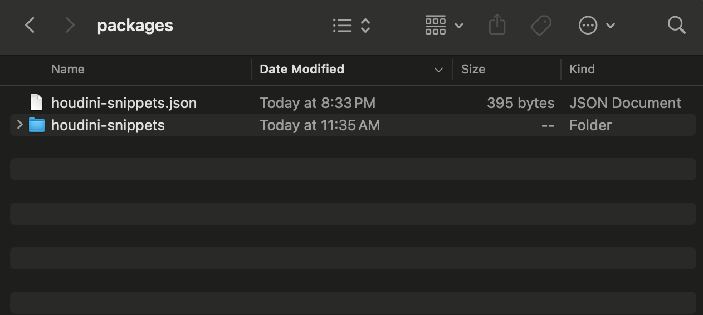

# Houdini Snippet Tool

The houdini snippet tool allows you to easily save and load your node networks. This tool allows an efficient way for you to manage a library of your nodes so that you can easily reuse node networks you've already created!

### Installation:
1. Download `houdini-snippets` and place the entire directory into your houdini packages folder.
2. Take the `houdini-snippets.json` file and move it into the root packages folder.
    
  
4. Add the shelf by clicking on the plus icon and turning the `Snippets` tab on.
    

### How to Use:
1. Click on the gear icon at the bottom of the Snippets window to open the preferences window and set the path to your snippets library.

    > Optionally, you can choose to add a network box or randomize the network box colors when loading snippets.

    
  
2. Select your nodes in Houdini and enter the file name in order to save.
3. Once you have saved files in your library, simply select on any of the files listed and click "Load".

